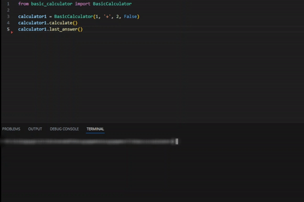

# 🧮 basic-calculator

Python module that create calculator objects (regular and scientific) and calculates given numbers and operation based on input from the user.
A sample module is uploaded to demonstrate how it works.

### 📂 Download

Click "**Code**" and pick the "**Download ZIP**" option.
